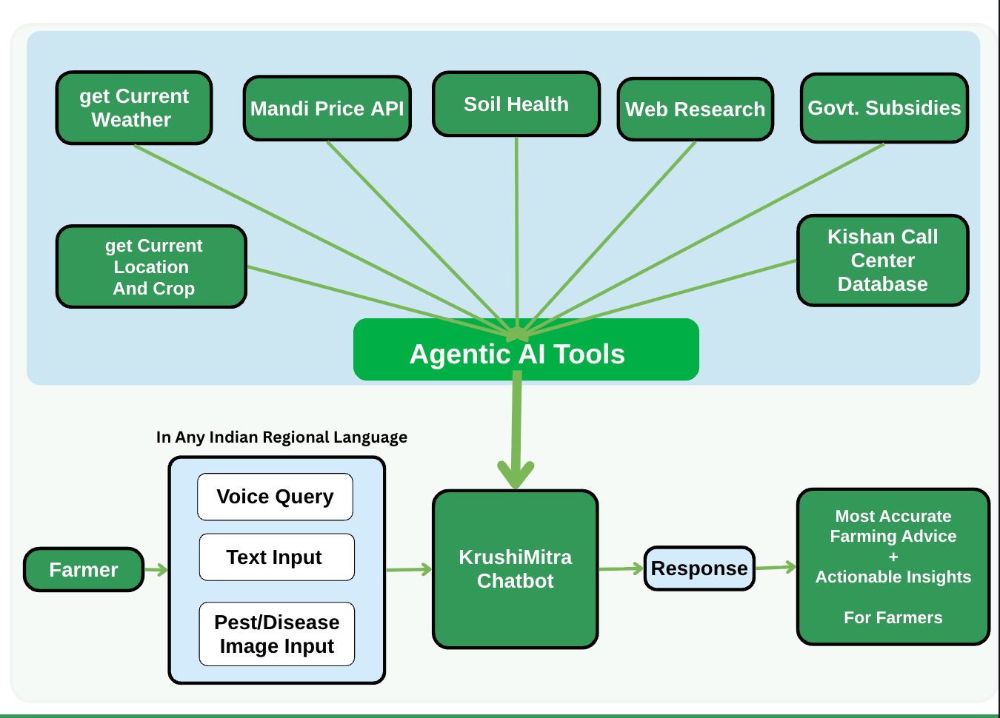
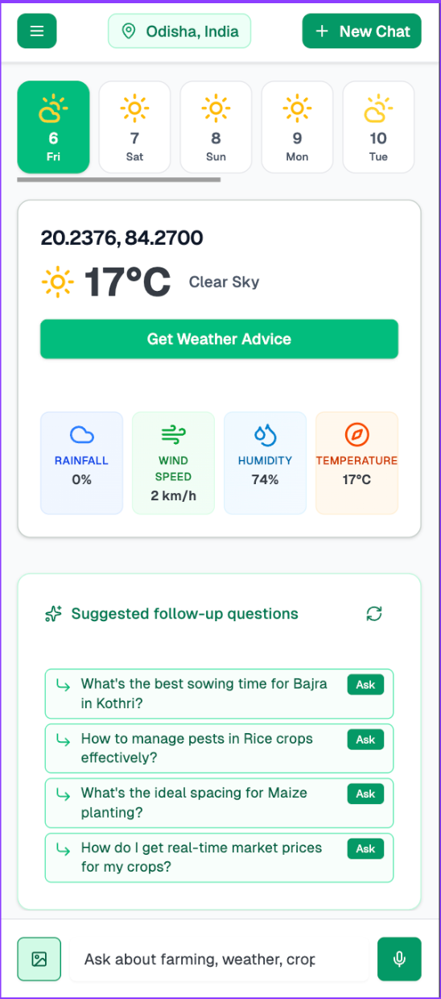
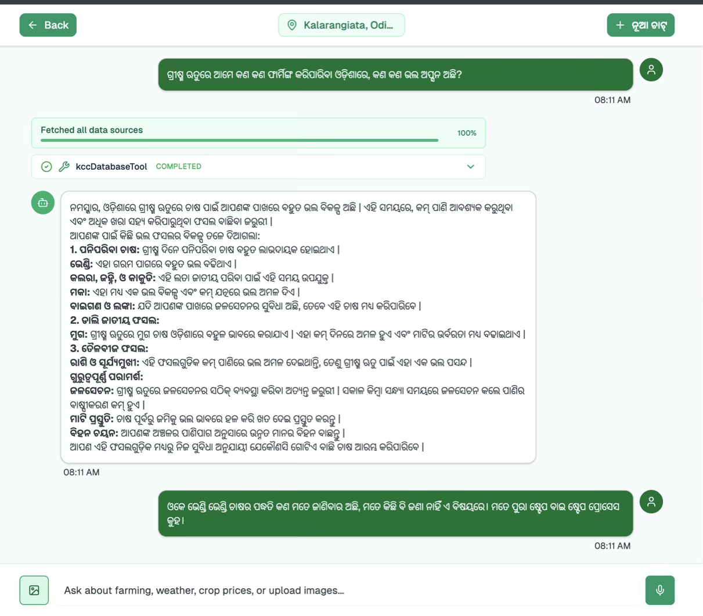
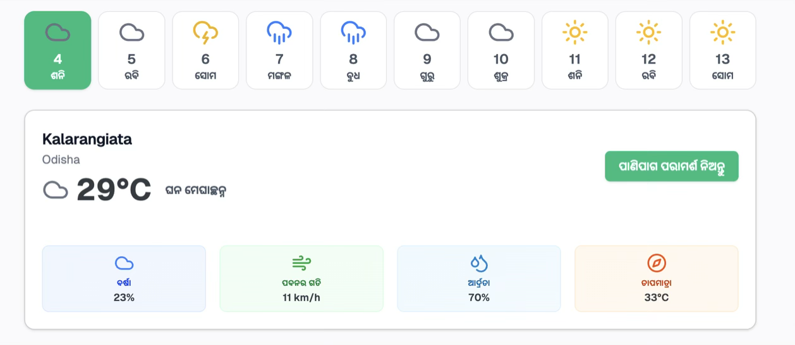
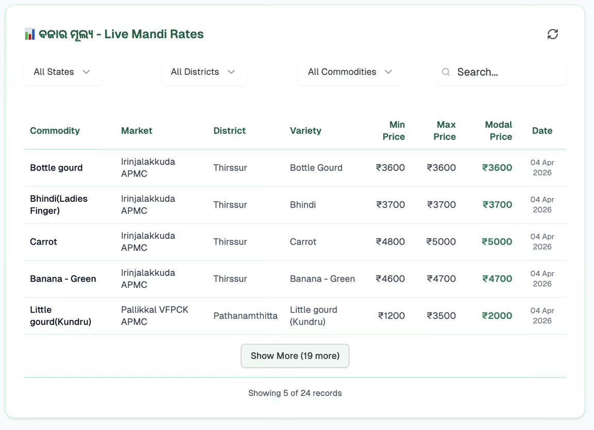

# KrushiMitra - AI Agent for Farmers Using RAG and Agentic AI

[](https://nextjs.org/)
[](https://www.typescriptlang.org/)
[](https://reactjs.org/)
[](https://mastra.ai/)

## Project Overview

**KrushiMitra (Farmeasy)** is a mission-critical agricultural AI platform designed with one primary goal: **provide the most accurate farming advice possible because every agricultural query has a price - wrong advice can devastate crops and destroy farmers' livelihoods.**

Built on advanced agentic AI technology grounded with custom-built vector databases and multi-source verification systems, KrushiMitra serves as a trusted digital farming companion that understands the life-or-death importance of accurate agricultural guidance.

## Screenshots
















### Mission-Critical Agricultural Intelligence

**We know that incorrect farming advice can:**

- Destroy entire crop yields
- Cause financial ruin for farming families
- Impact food security and livelihoods
- Lead to improper use of fertilizers and pesticides
- Result in wrong timing decisions that affect entire seasons

**That's why KrushiMitra implements:**

- **Custom KCC Vector Database** with 64,000+ verified agricultural solutions
- **Multi-Source Verification** from government data sources
- **Real-Time Data Integration** for current market and weather conditions
- **Agentic AI Validation** that cross-references multiple authoritative sources
- **RAG Architecture** to prevent AI hallucination in critical farming advice

### Agentic AI Architecture for Agricultural Safety

**KrushiMitra leverages agentic AI systems specifically designed for mission-critical agricultural decision-making where accuracy is paramount and mistakes can be catastrophic.**

#### Why Agentic AI for Life-Critical Agriculture?

Traditional chatbots and simple AI models are inadequate for agricultural advice because:

1. **Agricultural decisions affect entire crop cycles** - wrong advice can destroy months of work
2. **Financial stakes are enormous** - crop failure can bankrupt farming families
3. **Regional variations are critical** - generic advice fails in specific local conditions
4. **Multiple factors interact** - weather, soil, market, season must all be considered
5. **Information must be current** - outdated advice can be dangerous

**Our agentic approach ensures safety through:**

- **Autonomous Source Verification**: AI agent independently validates information across multiple authoritative sources
- **Multi-Source Data Integration**: Combines KCC vector database, live weather, real-time market prices, and web research
- **Context-Aware Safety Checks**: Considers farmer location, crop type, seasonal timing, and local conditions
- **Grounded Response Generation**: All advice traced back to verified government and expert sources
- **Real-Time Accuracy Validation**: Cross-references recommendations against current data before delivery

#### Core Platform Capabilities Built for Accuracy

- **Custom Vector Database Integration**: RAG-powered access to 64,000+ verified agricultural solutions
- **Multi-Language Intelligence**: Accurate agricultural terminology across 10+ Indian languages
- **Location-Aware Intelligence**: GPS-precise advice for specific farm locations and conditions
- **Real-Time Weather Integration**: Live weather data for timing-critical agricultural decisions
- **Government Market Intelligence**: Official mandi prices for accurate economic guidance
- **Voice-to-Text Interface**: Hands-free operation for farmers working in fields
- **Computer Vision Analysis**: AI-powered crop disease identification with expert-verified treatments
- **Mobile-First Design**: Accessible interface for rural smartphone users

## Architecture & Technology Stack

### Why These Technology Choices?

Our technology stack is specifically chosen to support agentic AI capabilities, real-time data processing, and farmer accessibility across diverse contexts.

### Agentic AI & LLM Infrastructure

**Mastra Framework** - Advanced AI agent orchestration platform

- **Why**: Purpose-built for multi-tool agentic workflows with complex decision trees
- **Benefit**: Enables sophisticated farming intelligence that autonomously coordinates multiple data sources

**Google Gemini 2.5 Flash** - Large language model for agricultural conversations

- **Why**: Superior reasoning capabilities for complex agricultural problem-solving
- **Benefit**: Understands nuanced farming contexts and provides human-like agricultural expertise

**AI SDK** - OpenAI and Google AI integrations with streaming support

- **Why**: Unified interface for different LLM providers with real-time response streaming
- **Benefit**: Seamless user experience with progressive response building

**Custom Agent Architecture** - Domain-specific farming intelligence agents

- **Why**: Generic AI lacks agricultural domain expertise and local farming knowledge
- **Benefit**: Specialized agents understand crop cycles, regional practices, and farmer terminology

### Data Sources & External API Integration

**Kisan Call Center (KCC) Database** - 500,000+ historical farming interactions

- **Why**: Largest repository of farmer-expert interactions in India
- **Benefit**: Proven solutions to real farming problems faced by Indian farmers

**Open-Meteo API** - Free, reliable weather data service

- **Why**: No API key required, reducing barriers to implementation
- **Benefit**: 7-day forecasts critical for farming decision timing

**Data.gov.in Mandi API** - Official government market price data

- **Why**: Authoritative source for commodity prices across Indian markets
- **Benefit**: Real-time pricing helps farmers make informed selling decisions

**Google Maps API** - Location services and geocoding

- **Why**: Precise location context essential for localized agricultural advice
- **Benefit**: Enables hyper-local recommendations based on specific farm locations

**Sarvam AI** - Multi-language speech-to-text and translation services

- **Why**: Specialized in Indian languages with agricultural terminology support
- **Benefit**: Enables voice interaction in farmers' native languages

## Agentic AI System Architecture

### Intelligent Farming Assistant (KCC Agent)

**The core of Farmeasy is an autonomous AI agent that makes intelligent decisions about which tools to use and how to combine information from multiple sources to provide actionable farming advice.**

#### Why Agentic AI Instead of Simple Chatbots?

Traditional chatbots follow predefined scripts and cannot adapt to complex, multi-faceted farming situations. Our agentic approach provides:

1. **Autonomous Decision Making**: Agent analyzes queries and independently chooses appropriate tools
2. **Dynamic Information Synthesis**: Combines data from multiple sources in real-time
3. **Context-Aware Reasoning**: Considers user profile, location, season, and crop-specific factors
4. **Adaptive Learning**: Improves responses based on user interactions and feedback

#### Advanced Agent Capabilities

**Multi-Source Knowledge Integration**

- Automatically queries historical KCC database for proven solutions
- Fetches real-time weather data when environmental factors are relevant
- Retrieves current market prices for economic decision-making
- Conducts web research to supplement knowledge with latest information

**Contextual Intelligence**

- Maintains awareness of user's location, crops, experience level, and farm details
- Adapts communication style based on user's language preference and technical expertise
- Considers seasonal timing and regional farming practices
- Remembers conversation history for contextual follow-up responses

**Real-Time Tool Orchestration**

- Dynamically selects which tools to execute based on query intent analysis
- Runs multiple tools in parallel when comprehensive information is needed
- Prioritizes information sources based on relevance and reliability
- Synthesizes results into coherent, actionable farming advice

**Language Intelligence Pipeline**

- Processes queries in 10+ Indian languages with automatic detection
- Translates queries to English for tool execution while preserving agricultural context
- Generates responses in user's preferred language with culturally appropriate terminology
- Handles code-switching and mixed-language conversations naturally

#### Autonomous Agent Workflow

**Phase 1: Intent Analysis & Planning**

```
User Query → Language Detection → Intent Classification → Tool Selection Strategy
```

- Identifies crop types, farming operations, location references, and time constraints
- Determines primary intent: disease diagnosis, weather planning, market timing, etc.
- Plans tool execution sequence based on query complexity and information requirements

**Phase 2: Intelligent Tool Execution**

```
KCC Database Query → Weather Data Retrieval → Market Price Lookup → Web Research (if needed)
```

- Always starts with historical KCC database for proven farming solutions
- Fetches location-specific weather when timing or environmental factors are relevant
- Retrieves market prices for crop-related economic decisions
- Supplements with web research when knowledge gaps exist

**Phase 3: Response Synthesis & Delivery**

```
Data Integration → Context Application → Response Generation → Language Translation
```

- Combines information from all sources into coherent advice
- Applies user-specific context (location, crops, experience) to recommendations
- Generates farmer-friendly explanations with clear action steps
- Translates final response to user's preferred language

### Specialized AI Tools Ecosystem

#### 1. KCC Vector Database Tool (kccDatabaseTool)

**Purpose**: Query our custom-built vector database containing 64,000+ processed KCC records with semantic embeddings

**Why We Built Our Own Vector Database:**

- **Cost Efficiency**: Training custom agricultural LLMs would cost millions of dollars
- **Data Freshness**: RAG allows real-time updates as agricultural information evolves
- **Accuracy Guarantee**: Retrieval-based responses prevent AI hallucination in critical agricultural advice
- **Transparency**: Every recommendation traceable to verified government sources

**Technical Implementation:**

- **Custom Vector Database**: 64,000+ records processed and optimized for agricultural queries
- **Embedding Generation**: Advanced vector embeddings for semantic similarity matching
- **RAG Architecture**: Retrieval-Augmented Generation for accurate, grounded responses
- **Backend Deployment**: Separate microservice for high-performance vector operations
- **Similarity Search**: Cosine similarity matching for contextually relevant solutions

**Database Processing Pipeline:**

```
Raw KCC Data → Data Cleaning → Agricultural Context Extraction → 
Vector Embedding Generation → Database Indexing → RAG Integration → 
Semantic Search Optimization
```

**Agent Integration:**

- **Primary Knowledge Source**: Always queried first for proven agricultural solutions
- **Confidence Scoring**: Solutions ranked by relevance and historical success
- **Context Filtering**: Results filtered by location, crop, season, and problem type
- **Accuracy Validation**: Retrieved solutions validated against multiple sources

#### 2. Weather Tool (weatherTool)

**Purpose**: Provide 7-day weather forecasts with agricultural impact analysis

**Why This Tool**:

- Weather is the primary external factor affecting all farming decisions
- Timing of agricultural operations depends critically on weather patterns
- Free, reliable API reduces implementation barriers

**Technical Implementation**:

- Open-Meteo API integration with no API key requirement
- Coordinate-based precise location targeting
- Agricultural weather codes interpretation (rainfall, temperature extremes, wind)
- 7-day forecast for strategic planning

**Agent Integration**:

- Triggered when queries involve timing: planting, harvesting, spraying
- Weather data influences advice timing and risk assessment
- Agent translates weather conditions into farming implications

#### 3. Mandi Price Tool (mandiPriceTool)

**Purpose**: Real-time agricultural commodity pricing from government sources

**Why This Tool**:

- Market timing is crucial for farmer profitability
- Government data ensures price accuracy and reliability
- Covers major crops across all Indian states and districts

**Technical Implementation**:

- Data.gov.in API integration for official mandi prices
- Multi-dimensional filtering: commodity, state, district, market
- Statistical analysis for price trends and recommendations
- Fallback recommendations when specific data unavailable

**Agent Integration**:

- Activated for queries involving crop selling, market conditions, or pricing
- Price trends influence agent's advice on harvest timing
- Economic factors combined with weather and seasonal data for comprehensive guidance

#### 4. Web Research Tool (webResearch)

**Purpose**: Latest agricultural information validation and knowledge gap filling

**Why This Tool**:

- Agricultural knowledge evolves rapidly with new research and techniques
- Validates historical KCC data against current best practices
- Provides recent pest outbreak information and treatment updates

**Technical Implementation**:

- Google Generative AI with Search Grounding for reliable web research
- Dynamic retrieval based on agent confidence levels
- Source attribution for transparent information sourcing
- Real-time access to latest agricultural research and news

**Agent Integration**:

- Used when KCC database lacks sufficient information
- Validates and supplements historical advice with current best practices
- Ensures recommendations reflect latest agricultural research

## Query Processing & Agricultural Use Cases

### Crop Management Intelligence

#### Disease & Pest Identification with Computer Vision

**Example Queries:**

```
- "My tomato leaves have yellow spots" (with image upload)
- "गेहूं में कीड़े लगे हैं क्या करूं?" (Hindi: What to do about insects in wheat?)
- "Rice blast disease treatment recommendations"
```

**Agentic AI Processing Pipeline:**

```
Image Analysis → Visual Pattern Recognition → KCC Database Search → 
Treatment Protocol Retrieval → Current Research Validation → 
Localized Recommendation Generation
```

**Why This Approach Works:**

- Combines visual AI with expert knowledge database
- Cross-references multiple treatment approaches
- Considers local environmental conditions and available treatments
- Provides step-by-step implementation guidance

#### Cultivation Practice Optimization

**Example Queries:**

```
- "When to plant rice in Punjab during monsoon season?"
- "Optimal fertilizer schedule for potato crop in sandy soil"
- "Cotton irrigation frequency during flowering stage"
```

**Agentic AI Processing Pipeline:**

```
Location Context Analysis → Seasonal Timing Calculation → 
Soil Type Consideration → Weather Pattern Integration → 
KCC Best Practices Retrieval → Regional Adaptation
```

**Why This Approach Works:**

- Integrates multiple environmental and temporal factors
- Adapts general practices to specific local conditions
- Considers farmer's experience level and resource availability
- Provides timeline-based implementation schedules

### Weather-Based Agricultural Decision Making

#### Predictive Weather Analysis for Farming Operations

**Example Queries:**

```
- "Should I harvest wheat this week or wait for better weather?"
- "When is the best time to spray pesticides based on upcoming weather?"
- "मौसम के अनुसार बुआई का सही समय" (Hindi: Right sowing time according to weather)
```

**Agentic AI Processing Pipeline:**

```
Weather Forecast Retrieval → Agricultural Impact Analysis → 
Risk Assessment Calculation → Timing Optimization → 
Operation-Specific Recommendations
```

**Why This Approach Works:**

- Real-time weather data combined with agricultural expertise
- Predicts impact of weather patterns on specific farming operations
- Provides risk mitigation strategies for adverse conditions
- Optimizes timing for maximum crop benefit

### Market Intelligence & Economic Decision Support

#### Price-Based Selling Strategy

**Example Queries:**

```
- "Current onion prices in Maharashtra mandis - should I sell now?"
- "আলুর দাম কবে বাড়বে?" (Bengali: When will potato prices increase?)
- "Best time to sell tomatoes for maximum profit"
```

**Agentic AI Processing Pipeline:**

```
Current Price Retrieval → Historical Trend Analysis → 
Seasonal Pattern Recognition → Market Demand Assessment → 
Selling Strategy Recommendation
```

**Why This Approach Works:**

- Combines real-time pricing with historical patterns
- Considers seasonal demand fluctuations
- Factors in regional market variations
- Provides data-driven economic guidance

### Advanced Agricultural Problem Solving

#### Multi-Factor Decision Support

**Example Queries:**

```
- "Low yield in rice crop - consider soil, weather, and pest factors"
- "Farm profitability improvement strategies for small farmers"
- "Organic farming transition plan with market considerations"
```

**Agentic AI Processing Pipeline:**

```
Problem Decomposition → Multi-Factor Analysis → 
Root Cause Identification → Solution Strategy Development → 
Implementation Roadmap Creation
```

**Why This Approach Works:**

- Handles complex, multi-dimensional agricultural problems
- Considers interconnected factors affecting farm performance
- Provides systematic problem-solving frameworks
- Adapts solutions to farmer's specific context and resources

## Advanced Platform Features

### Multi-Language Voice Interface

#### Why Voice-First Design for Agricultural Users?

Rural farmers often have limited literacy and prefer spoken communication. Voice interfaces remove barriers to accessing agricultural expertise and enable hands-free operation while working in fields.

**Technical Implementation:**

- **Sarvam AI Speech-to-Text API** for Indian language specialization
- **Auto-language Detection** across 10+ regional languages
- **Real-time Audio Processing** with noise cancellation for outdoor environments
- **Instant Query Submission** for immediate agricultural advice

**Supported Audio Formats:** WebM, WAV, MP3, OGG for maximum device compatibility

```typescript
// Voice processing architecture
const useVoiceRecording = () => {
  // Captures audio from device microphone
  // Processes multiple audio formats for device compatibility
  // Converts speech to text using Sarvam AI specialized for Indian languages
  // Automatically submits transcribed query to agentic AI system
  // Handles network failures and audio quality issues gracefully
}
```

### Computer Vision for Agricultural Analysis

#### Why Image Analysis is Critical for Crop Management?

Visual symptoms are often the first indication of crop diseases, pest infestations, or nutrient deficiencies. Farmers need immediate identification and treatment recommendations to prevent crop losses.

**Technical Implementation:**

- **Multi-format Support**: JPEG, PNG, WebP for different camera types
- **Automatic Compression**: Optimizes images for mobile network transmission
- **Base64 Encoding**: Secure image transmission to AI analysis systems
- **Real-time Processing**: Immediate analysis combined with text queries

**Agricultural Applications:**

- Disease symptom identification from leaf images
- Pest detection and species identification
- Nutrient deficiency visual diagnosis
- Crop maturity assessment for harvest timing

### Location Intelligence System

#### Why Precise Location Context Matters in Agriculture?

Agricultural advice must be hyper-localized due to variations in climate, soil types, pest pressures, and regional farming practices within even small geographic areas.

**Technical Implementation:**

```typescript
// Location context management
const useLocationContext = () => {
  // GPS coordinate detection for precise location targeting
  // Google Places API integration for location search and validation
  // Local storage persistence for offline access
  // Real-time weather and market data updating based on location changes
  // Privacy-controlled location sharing with user consent
}
```

**Location-Based Features:**

- **Automatic GPS Detection**: One-click location identification
- **Address Autocomplete**: Google Places integration for easy location entry
- **Persistent Storage**: Location remembered across sessions
- **Context Integration**: City, state, coordinates, and farm area size
- **Privacy Controls**: User manages location sharing preferences

### Real-Time Streaming Architecture

#### Why Streaming Responses for Agricultural AI?

Agricultural queries often require multiple tool executions and complex analysis. Streaming provides transparency into the AI's reasoning process and builds user trust by showing active problem-solving.

**Technical Implementation:**

- **Server-Sent Events (SSE)** for real-time communication
- **Progressive Response Building** shows AI working through the problem
- **Tool Execution Visualization** displays which data sources are being consulted
- **Error Recovery Mechanisms** handle network interruptions gracefully

**User Experience Benefits:**

- Farmers see AI actively working on their problem
- Tool execution transparency builds trust in recommendations
- Progress indicators prevent user abandonment during complex queries
- Real-time status updates improve perceived responsiveness

### Intelligent Query Suggestions

#### Why Context-Aware Suggestions Enhance Agricultural Learning?

Farmers often don't know what questions to ask next. Intelligent suggestions guide users toward comprehensive agricultural planning and problem-solving.

**Technical Implementation:**

- **Conversation Analysis**: Sarvam AI analyzes chat history for relevant follow-ups
- **User Profile Integration**: Considers farmer's crops, experience, and location
- **Language-Specific Generation**: Creates suggestions in user's preferred language
- **Expertise Adaptation**: Adjusts complexity based on user's farming experience

**Suggestion Generation Process:**

```
1. Analyze last conversation exchange for context
2. Consider user profile: crops, experience level, farm location
3. Generate 4 contextually relevant follow-up questions
4. Translate suggestions to user's preferred language
5. Present as clickable options for easy interaction
```

## API Architecture & Integration Patterns

### Agentic Data Flow Architecture

```
User Input → Intent Analysis → Agent Planning → Tool Orchestration → Data Synthesis → Response Streaming
     ↑                                                                                        ↓
Context Injection ← User Profile ← Location Data ← Previous Conversations ← Real-time Updates
```

**Why This Architecture?**

- **Separation of Concerns**: Each API handles specific functionality for maintainability
- **Scalability**: Stateless design enables horizontal scaling as user base grows
- **Reliability**: Multiple fallback mechanisms ensure service availability
- **Performance**: Streaming responses provide immediate user feedback during processing
- **Extensibility**: Modular design allows adding new tools and capabilities without breaking existing functionality

## Components & UI Framework

### Design System Architecture

```###

#### Why Mobile-First for Agricultural Users?

Rural farmers primarily access internet through smartphones due to cost and infrastructure constraints. The interface must be optimized for touch interaction and variable network conditions.

**Design Principles:**

- **Large Touch Targets**: Easy interaction for users wearing gloves or in field conditions
- **Gesture Support**: Intuitive swipe and tap interactions
- **High Contrast**: Visibility in bright outdoor lighting conditions
- **Minimal Data Usage**: Optimized for poor network connections
- **Offline Capability**: Progressive Web App features for intermittent connectivity


## Database & Knowledge Sources

### KCC Vector Database - The Foundation of Agricultural Intelligence

#### Mission-Critical Accuracy in Agricultural AI

**Every agricultural query has a cost. Wrong advice can devastate crops, destroy livelihoods, and impact food security. That's why KrushiMitra is built on the principle of maximum accuracy through verified, government-sourced data and multi-layered validation.**

#### Custom-Built KCC Vector Database with RAG Architecture

**Our platform is completely trained on the Kisan Call Center database - 64,000+ verified agricultural solutions where each entry represents a real farmer problem solved by certified agricultural experts and government officers.**

**Why RAG Instead of Model Training?**

1. **Cost Efficiency**: Training custom LLMs costs millions; RAG provides expert-level accuracy at a fraction of the cost
2. **Data Freshness**: Agricultural conditions change constantly - RAG allows real-time knowledge updates without retraining
3. **Accuracy Guarantee**: RAG retrieves exact expert solutions rather than generating potentially dangerous hallucinated advice
4. **Transparency**: Every recommendation traces back to specific government-verified expert consultations
5. **Safety First**: In agriculture, being approximately right isn't enough - farmers need precisely correct advice

**Training Data Sources & Verification:**

- **64,000+ Expert Consultations**: Real farmer queries solved by certified agricultural scientists
- **Government Authority**: All solutions verified by Ministry of Agriculture & Farmers Welfare experts
- **Multi-Crop Intelligence**: Covers 200+ crops across all Indian agro-climatic zones
- **Regional Validation**: Solutions tested and verified by local agricultural extension officers
- **Seasonal Expertise**: Time-sensitive guidance validated for specific crop calendars and growing seasons
- **Problem-Solution Mapping**: Direct linkage between farmer problems and expert-verified solutions

**Our KCC Vector Database Implementation:**

```

Custom Vector Database: 64,000+ processed records
Source: Kisan Call Center (Government of India)
Vector Embeddings: Generated for semantic similarity search
Processing: Cleaned, structured, and optimized for agricultural queries
Backend: Deployed as separate microservice for RAG operations

Vector Embedding Structure: {
id: string,                    // Unique vector identifier
embedding: float[],            // 1536-dimensional vector representation
similarity_score: number,      // Cosine similarity for query matching
StateName: string,            // Geographic context for localization
DistrictName: string,         // District-level agricultural context
Category: string,             // Agricultural problem classification
QueryType: string,            // Specific farming issue type
QueryText: string,            // Original farmer question (processed)
KccAns: string,              // Expert-verified agricultural solution
Crop: string,                // Relevant crop information
Season: string,              // Agricultural season context
CreatedOn: string,           // Temporal relevance
confidence: number           // Solution reliability score
}

```
#### RAG-Powered Retrieval System

**Semantic Search Architecture:**

- Advanced vector similarity matching for agricultural context understanding
- Multi-dimensional filtering by location, crop, season, and problem type
- Confidence scoring for solution ranking and reliability assessment
- Real-time retrieval of most relevant historical solutions

**Why This Approach Ensures Accuracy:**

- **Government-Verified Sources**: Every solution comes from official KCC expert responses
- **Proven Track Record**: All recommendations have been tested by real farmers
- **Regional Specificity**: Solutions adapted to specific Indian agricultural conditions
- **Temporal Relevance**: Seasonal and time-sensitive agricultural guidance

### Multi-Source Verification for Life-Critical Agricultural Accuracy

#### The Cost of Agricultural Mistakes

**In agriculture, there are no second chances. A wrong recommendation during planting season can destroy an entire year's income. A missed pest alert can devastate crops. Incorrect fertilizer advice can poison soil for years. That's why KrushiMitra employs a multi-layered verification system where EVERY piece of advice is validated through multiple authoritative sources before reaching farmers.**

#### Four-Layer Verification Architecture

**Layer 1: KCC Vector Database (Primary Source)**

- **64,000+ Government-Verified Solutions**: Core foundation of expert-validated agricultural knowledge
- **Expert Authority**: Every solution verified by certified agricultural scientists and extension officers
- **Real Farmer Validation**: Solutions tested and proven effective by actual farmers
- **Government Backing**: Official Ministry of Agriculture endorsement and continuous validation

**Layer 2: Real-Time Government Data Integration**

**Live Mandi Prices (Data.gov.in)**

- **Purpose**: Prevent economic losses through accurate market timing
- **Authority**: Official Government of India market intelligence
- **Verification**: Cross-validated with multiple state mandi boards
- **Critical Impact**: Wrong price advice can cost farmers thousands in lost revenue

**Weather Intelligence (Open-Meteo)**

- **Purpose**: Prevent crop damage through precise weather-based timing
- **Authority**: Meteorological data validated for agricultural decision-making
- **Verification**: Agricultural impact analysis for farming operations
- **Critical Impact**: Wrong weather advice can destroy entire harvests

**Government Schemes & Policies (KCC Vector DB)**

- **Purpose**: Ensure farmers access all available government support
- **Authority**: Verified policy documents from official government sources
- **Verification**: Continuous validation of scheme eligibility and benefits
- **Critical Impact**: Missing subsidies and support can determine farm viability

**Layer 3: AI-Powered Cross-Verification**

**Google Search with Expert Filtering**

- **Purpose**: Final fact-checking against latest research and best practices
- **Process**: AI agent autonomously searches and validates all recommendations
- **Quality Control**: Expert-level filtering of search results for agricultural relevance
- **Authority**: Cross-reference with university research and agricultural institutions

**Layer 4: Context-Aware Safety Checks**

**Every response undergoes final validation considering:**

1. **Farm Location**: GPS-precise location for hyper-local advice
2. **Weather Patterns**: Current and forecasted weather conditions
3. **User Context**: Farmer's experience, crops, farm size, and history
4. **Seasonal Timing**: Agricultural calendar and optimal operation timing
5. **Market Conditions**: Current prices and market trends
6. **Regional Practices**: Local farming methods and cultural considerations

#### Accuracy Safeguards

**Multi-Layer Validation Process:**

```

User Query → KCC Vector DB Retrieval → Weather Data Integration →
Market Price Analysis → Government Scheme Lookup → Web Research Verification →
Context Application → Accuracy Scoring → Final Response Generation

```
**Why This Approach Guarantees Accuracy:**

- **Multiple Source Verification**: No single source of truth - all information cross-verified
- **Government Data Priority**: Official sources given highest credibility weight
- **Real-Time Updates**: Live data prevents outdated advice
- **Regional Adaptation**: Location-specific advice prevents generic recommendations
- **Expert-Validated Solutions**: All KCC database entries verified by agricultural experts

### Data Processing and Quality Assurance

#### Why Sophisticated Data Processing Matters?

Agricultural advice must be accurate, timely, and locally relevant. Poor data quality can lead to crop failures and economic losses for farmers.

**Quality Assurance Mechanisms:**

- **Source Verification**: All data sources verified for accuracy and authority
- **Temporal Relevance**: Information age weighting for current applicability
- **Geographic Validation**: Location-appropriate advice filtering
- **Expert Review**: Critical advice validated against established agricultural practices
- **User Feedback Integration**: Farmer feedback improves recommendation quality over time

## Multi-Language Intelligence System

### Supported Language Ecosystem

#### Primary Agricultural Languages

1. **English** - Global interface and tool execution language
2. **Hindi (हिन्दी)** - Primary language for North Indian farmers
3. **Bengali (বাংলা)** - Dominant in West Bengal and Bangladesh agricultural regions
4. **Marathi (मराठी)** - Essential for Maharashtra's diverse farming communities
5. **Telugu (తెలుగు)** - Critical for Andhra Pradesh and Telangana agricultural states
6. **Tamil (தமிழ்)** - Primary language for Tamil Nadu's intensive agricultural regions
7. **Gujarati (ગુજરાતી)** - Important for Gujarat's commercial farming sector
8. **Urdu (اردو)** - Significant in parts of northern India and Pakistan
9. **Kannada (ಕನ್ನಡ)** - Essential for Karnataka's agricultural diversity
10. **Odia (ଓଡ଼ିଆ)** - Primary language for Odisha's farming communities

### Agentic Translation Architecture

#### Why Sophisticated Language Processing is Critical?

Agricultural terminology varies significantly across regions, and farming practices are deeply embedded in local languages and cultural contexts. Simple translation fails to capture nuanced agricultural knowledge.

**Intelligent Translation Pipeline:**

```

User Query → Language Detection → Agricultural Context Analysis →
English Translation for Tools → Tool Execution → Result Analysis →
Cultural Adaptation → Response Translation → User Language Delivery

```
#### Advanced Language Processing Implementation

```typescript
// Agentic language handling system
const processMultilingualQuery = async (query: string, userLanguage: string) => {
  // Phase 1: Language and context detection
  const detectedLanguage = detectLanguage(query);
  const agriculturalContext = extractAgricultureTerms(query);
  
  // Phase 2: Intelligent translation preserving agricultural meaning
  const englishQuery = translateWithAgricultureContext(query, agriculturalContext);
  
  // Phase 3: Tool execution in English for consistency
  const toolResults = await executeAgentTools(englishQuery);
  
  // Phase 4: Cultural adaptation and response translation
  const culturallyAdaptedResponse = adaptToRegionalPractices(toolResults, userLanguage);
  const finalResponse = translateWithAgricultureTerminology(culturallyAdaptedResponse, userLanguage);
  
  return finalResponse;
}
```

#### Advanced Language Features

**Contextual Translation Intelligence**

- **Agricultural Terminology Preservation**: Maintains technical accuracy across languages
- **Regional Practice Integration**: Adapts advice to local farming customs and methods
- **Cultural Sensitivity**: Respects traditional farming knowledge while introducing modern techniques
- **Code-Switching Support**: Handles mixed-language conversations common in multilingual regions

**Language-Specific Adaptations**

- **Currency Localization**: Displays prices in appropriate regional currencies
- **Unit System Adaptation**: Uses familiar measurement systems (metric for India)
- **Seasonal Calendar Integration**: Aligns with local agricultural calendars and festivals
- **Regional Crop Varieties**: References locally known crop varieties and terminology

### Why This Multi-Language Approach?

**Accessibility**: Removes language barriers that prevent farmers from accessing agricultural expertise
**Trust**: Farmers trust advice delivered in their native language with familiar terminology
**Adoption**: Higher likelihood of implementing advice when communicated in familiar cultural context
**Scalability**: Enables platform expansion across diverse linguistic regions without losing effectiveness

## Getting Started

### Prerequisites

#### System Requirements

- **Node.js**: v18.0.0 or higher (for modern JavaScript features and performance)
- **Package Manager**: npm, yarn, or pnpm (dependency management)
- **Browser**: Modern browser with ES2020 support (for AI SDK compatibility)
- **Memory**: 2GB RAM minimum, 4GB recommended (for development and building)
- **Storage**: 1GB free space for dependencies and build artifacts

#### Required API Keys for Full Functionality

**Google Generative AI API** - Core agentic AI functionality

- Required for: Main AI agent operation, tool orchestration, response generation
- Cost: Pay-per-use pricing based on token consumption
- Setup: Google AI Studio account required

**Sarvam AI API** - Multi-language speech and translation services

- Required for: Voice-to-text conversion, multi-language support
- Cost: Subscription-based pricing for Indian language specialization
- Setup: Sarvam AI platform registration required

**Mandi Price API (Data.gov.in)** - Real-time market data

- Required for: Live agricultural commodity pricing
- Cost: Free government API with registration
- Setup: Data.gov.in account and API key generation

**Google Maps API** - Location services (optional but recommended)

- Required for: Enhanced location search and geocoding
- Cost: Free tier available, pay-per-use for high volume
- Setup: Google Cloud Platform account required

### Installation Process

#### 1. Repository Setup

```bash
git clone https://github.com/Gyana491/krushimitra-ai-agent

cd krushimitra-ai-agent
```

#### 2. Dependency Installation

```bash
# Using npm (recommended for this project)
npm install

# Alternative package managers
yarn install    # Using Yarn
pnpm install    # Using pnpm for faster installs
```

#### 3. Environment Configuration

```bash
# Copy environment template
cp .env.example .env.local

# Edit with your API keys
nano .env.local    # Linux/Mac
notepad .env.local # Windows
```

#### 4. Development Server Launch

```bash
# Standard development server
npm run dev

# With Turbopack for faster builds (experimental)
npm run dev:mastra

# Open browser to view application
open http://localhost:3000  # Mac
start http://localhost:3000 # Windows
```

### Environment Configuration

#### Complete Environment Variables Setup

```bash
# .env.local - Copy and fill with your actual API keys

# Core AI Functionality (REQUIRED)
GOOGLE_GENERATIVE_AI_API_KEY=your_google_ai_api_key_here

# Multi-language Support (REQUIRED)
SARVAM_API_KEY=your_sarvam_ai_subscription_key_here

# Market Data Integration (REQUIRED)
MANDI_PRICE_API_KEY=your_data_gov_in_api_key_here

# Enhanced Location Services (OPTIONAL)
NEXT_PUBLIC_GOOGLE_MAPS_API_KEY=your_google_maps_api_key_here

# Application Configuration
NEXT_PUBLIC_APP_URL=http://localhost:3000
NEXT_PUBLIC_APP_NAME=Farmeasy
NODE_ENV=development
```

#### API Key Acquisition Guide

**Google Generative AI Setup:**

1. Navigate to [Google AI Studio](https://aistudio.google.com/)
2. Sign in with Google account or create new account
3. Create new project or select existing project
4. Navigate to API & Services → Credentials
5. Click "Create Credentials" → "API Key"
6. Enable Generative AI API for your project
7. Copy API key to environment variables

**Sarvam AI Setup:**

1. Register at [Sarvam AI Platform](https://www.sarvam.ai/)
2. Complete account verification process
3. Subscribe to Speech-to-Text and Translation services
4. Navigate to API section in dashboard
5. Generate subscription key for API access
6. Copy subscription key to environment variables

**Data.gov.in Mandi Prices Setup:**

1. Visit [Data.gov.in](https://data.gov.in/)
2. Create account and complete registration
3. Search for "Daily Price and Arrival Report"
4. Subscribe to the mandi price dataset
5. Generate API key from your dashboard
6. Copy API key to environment variables

**Google Maps API Setup (Optional):**

1. Go to [Google Cloud Console](https://console.cloud.google.com/)
2. Create new project or select existing project
3. Enable Google Maps JavaScript API and Places API
4. Create credentials (API key) with appropriate restrictions
5. Set up billing (free tier available)
6. Copy API key to environment variables

### 🏗️ Development Workflow

#### Project Structure Deep Dive

```
frontend/
├── app/                    # Next.js App Router
│   ├── api/               # API routes
│   │   ├── chat/          # Main chat endpoint
│   │   ├── speech-to-text/ # Voice processing
│   │   ├── suggested-queries/ # Query suggestions
│   │   └── weather/       # Weather API
│   ├── globals.css        # Global styles
│   ├── layout.tsx         # Root layout
│   └── page.tsx          # Home page
├── components/            # React components
│   ├── ui/               # Base UI components
│   ├── enhanced-chat-*   # Chat interface
│   ├── weather-section.tsx # Weather dashboard
│   ├── market-price-*    # Market interface
│   ├── location-*        # Location components
│   └── onboarding-flow.tsx # User onboarding
├── hooks/                # Custom React hooks
│   ├── use-chat-*        # Chat functionality
│   ├── use-location*     # Location services
│   ├── use-speech-*      # Voice features
│   └── use-translation.ts # I18n support
├── lib/                  # Utility libraries
│   ├── utils.ts          # Common utilities
│   ├── crops.ts          # Crop data
│   └── storage-utils.ts  # Local storage
├── mastra/               # AI agent framework
│   ├── agents/           # AI agents
│   │   └── kcc-agent.ts  # Main farming agent
│   ├── tools/            # AI tools
│   │   ├── kcc-tool.ts   # KCC database
│   │   ├── weather-tool.ts # Weather API
│   │   ├── mandi-price-tool.ts # Market prices
│   │   └── webresearch-tool.ts # Web research
│   └── index/            # Data indices
└── public/               # Static assets
```

#### Development Commands

```bash
# Development with hot reload
npm run dev

# Mastra agent development
npm run dev:mastra

# Type checking
npx tsc --noEmit

# Linting
npm run lint

# Build for production
npm run build

# Start production server
npm run start
```

#### Code Quality Tools

- **TypeScript**: Strict type checking
- **ESLint**: Code linting and formatting
- **Prettier**: Code formatting (via ESLint)
- **Husky**: Git hooks for quality gates
- **Tailwind CSS**: Utility-first styling

## Deployment

### 🌐 Production Deployment

#### Vercel (Recommended)

```bash
# Install Vercel CLI
npm i -g vercel

# Deploy
vercel

# Environment variables
vercel env add GOOGLE_GENERATIVE_AI_API_KEY
vercel env add SARVAM_API_KEY
vercel env add MANDI_PRICE_API_KEY
```

#### Docker Deployment

```dockerfile
# Dockerfile
FROM node:18-alpine
WORKDIR /app
COPY package*.json ./
RUN npm ci --only=production
COPY . .
RUN npm run build
EXPOSE 3000
CMD ["npm", "start"]
```

#### AWS/GCP Deployment

```bash
# Build Docker image
docker build -t farmeasy-frontend .

# Deploy to cloud
# (Platform-specific commands)
```

### 🔧 Production Configuration

#### Performance Optimizations

- **Code Splitting**: Automatic route-based splitting
- **Image Optimization**: Next.js Image component
- **Caching**: Static asset caching and API response caching
- **Compression**: Gzip/Brotli compression
- **CDN**: Static asset delivery via CDN

#### Monitoring & Analytics

- **Error Tracking**: Sentry integration (recommended)
- **Performance**: Web Vitals monitoring
- **User Analytics**: Privacy-focused analytics
- **API Monitoring**: Response time and error tracking

#### Security Features

- **HTTPS**: Enforced SSL/TLS
- **CSP**: Content Security Policy headers
- **Rate Limiting**: API rate limiting
- **Input Validation**: Sanitization and validation
- **Authentication**: Secure user sessions
